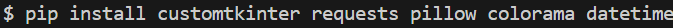

# Weather application

Цей проект розроблено з метою ознайомлення із роботою API, принципом отримання даних від віддаленого серверу, вмінням їх обробляти, структурувати та застосовувати у своємо проєкті. А саме застосовувалось API такого веб-ресурсу як [OpenWeatherMap](https://openweathermap.org). Проєкт допоможе розібратися із роботою файлів JSON, як правильно отримувати та зберігати дані у файлах з типом .json. Та познайомити користувача з інтерфейсом застосунку розробленим за допомогою пакету [CustomTkinter](https://customtkinter.tomschimansky.com)

### Зміст репозиторія:

1. [Основні модулі проєкту](#all-modules)
2. [Розгортання проєкту](#download-project)
3. [Створення віртуального оточення проєкту](#create-venv)
4. [Завантаження модулів до віртуального оточення](#download-modules-venv)
5. [Старт проєкту](#start-project)
6. [Основні механіки проєкту](#all-mechanics)
7. [Висновок по проєкту](#result) 
___
<h4 id= 'all-modules'>Основні модулі проєкту:</h4>
All modules

- [customtkinter](https://customtkinter.tomschimansky.com/)
- [json](https://docs.python.org/3/library/json.html)
- [requests](https://pypi.org/project/requests/)
- [pillow](https://pypi.org/project/pillow/)
- [os](https://docs.python.org/3/library/os.html)
- [colorama](https://pypi.org/project/colorama/)
- [datetime](https://docs.python.org/3/library/datetime.html#module-datetime)
___
<h4 id= 'download-project'>Розгортання проєкту:</h4>
Download project

1. Склонувати з Git Hub репозиторію
   
    1. Зайти на Git Hub репозиторій проекту
    2. Натиснути на зелену кнопку "Code"
   
    3. Скопіювати посилання
   
    4. Відкрити термінал
    5. Прописати команду `'git clone та вставити посилання'`
   

2. Завантажити за допомогою zip-архіву

    1. Розархівувати zip-архів
   
    2. Відкрити цю папку в VS Code
   
___
<h4 id= 'create-venv'>Створення віртуального оточення проєкту:</h4>
Сreate venv

1. Windows

    1. Відкрити термінал (GitBash) та перейти в директорію проекта
   
    2. Прописати команду `'python -m venv venv(назва директорії)'`
    3. Активувати за допомогою команди `cd venv/Scripts`
`.\activate.bat`
   

1. Mac OS або Linux

    1. Відкрити термінал та перейти в директорію проекта
    2. Прописати команду `'python3 -m venv venv(назва директорії)'`
    3. Активувати за допомогою команди `'source venv/bin/activate'`
   
___
<h4 id= 'download-modules-venv'>Завантаження модулів до віртуального оточення:</h4>
Download modules venv

1. Окремими модулями
   - Прописати команду '`pip install та назви модулів` [вище](#all-modules)'
   

2. За допомогою файлу requirements.txt
   - Прописати команду '`pip install -r requirements.txt`'
  

___
<h4 id= 'start-project'>Старт проєкту:</h4>
Start project

   1. Відкрити термінал
   2. Прописати `'python(3) main.py'`
    

___
<h4 id= 'all-mechanics'>Основні механіки проєкту:</h4>
All mechanics

- `api key` - забезпечують безпеку та контроль доступу до інформації, що надається через API. 
- `json` - інструменти для роботи з форматом даних JSON.  Використовується для обміну даних.
- `os` - використовується для роботи з шляхами.
- `requests` - використовується для відправки запитів
- `colorama` - використовується для виводу кольорового тексту в консолі

<h4 id= 'result'>Висновок по проєкту:</h4>
Result

- В цьому проєкті я навчилася працювати з customtkinter, requests, pillow, colorama, datetime. Також я працювала в терміналі та навчилася структурувати код. Я дізналася, як брати дані з веб-ресурсу OpenWeatherMap та використовувати їх. Та в результаті я отримала додаток погоди, написаний на Python.
